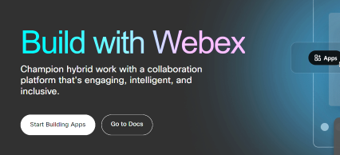
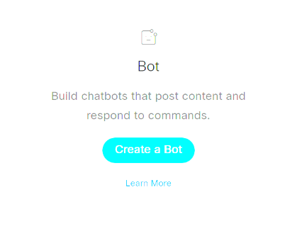
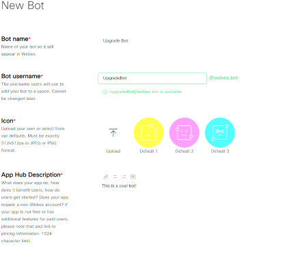
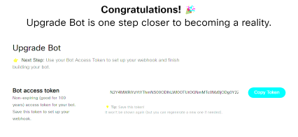
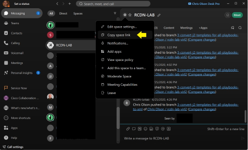

## LAB_UPGRADE
Upgrade Cisco IOSXR routers using GISO and PXE/ZTP.

## Description
Upgrades Cisco IOSXR routers using the PXE boot process and ZTP. The playbook backs up the configuration of all routers to an HTTP repository, updates the ISC DHCP servers dhcpd.conf file for image and configuration location, reboots the routers specifying network boot and monitors status. The playbook also includes Cisco Webex integration so messages can be sent by a bot notifying a user or room of the upgrade status.

The upgrade process installs an xr7 base .iso or and xr7/eXR Golden ISO (GISO). The process of created a GISO is outside the scope of this project but the tool and instructions can be found at this [GitRepo](https://github.com/ios-xr/gisobuild).

## Installation
Installation has been developed and tested using Ubuntu 20.04 and python 3.8.
Clone the repository and optionally create a virtual environment.
```
hostname:~/some/directory$ git clone https://github.com/christoo-cisco/IOSXR_Upgrade.git
hostname:~/some/directory$ cd lab_upgrade
hostname:~/some/directory/lab_upgrade$ 

Optinal but recomended:
hostname:~/some/directory/lab_upgrade$ pip install venv
hostname:~/some/directory/lab_upgrade$ python3 -m venv env_name
hostname:~/some/directory/lab_upgrade$ source env_name/bin/activate
(env_name) hostname:~/some/directory/lab_upgrade$ pip install -r requirements.txt
```
## Setup
Prior to starting the upgrade workflow xr7 base .iso or xr7/eXR GISO files need to be pre-positioned in the repo represented in the PXE_path: variable defined in the [all.yml](all.yml) file.

There are several files and variables that will need to be edited for your environment.

- [ ] First updated the [hosts.yml](hosts.yml) file to include all the IOSXR routers in your environment. It is helpful to organize these routers into groups by device type as in the example file.
- [ ] Next update the [all.yml](all.yml) to include all the appropriate information for your environment. If using Webex integration see below for bot creation instructions.
- [ ] Finaly build a GROUP.yml file for each device type group you created in the [hosts.yml](hosts.yml) file.

## Usage
```
(env_name) hostname:~/some/directory/lab_upgrade$ ansible-playbook -i hosts.yml upgrade_nodes.yml
```

## Webex integration
Create an account or log into developer.cisco.com, after logging in click the "Start Building Apps" button.



Next click the "Create a bot" button.



Fill out the form with you Bot info and click submit.



Copy the access token and add it to the [all.yml](all.yml) file wx_personal_token variable.



Now add the Bot to a Webex space.


Copy the space link and paste it into the [all.yml](all.yml) file wx_recipient_id variable removing everything except the number sting after the "space=".


